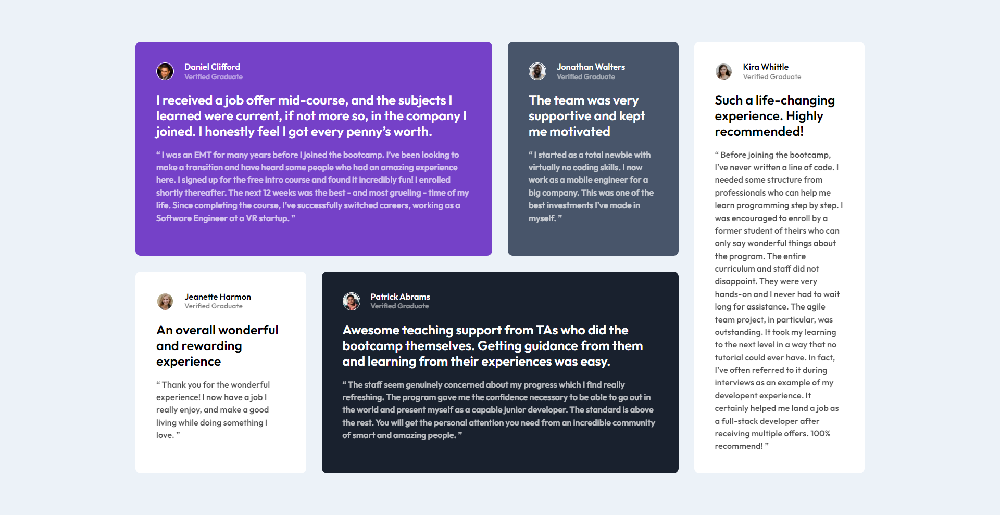
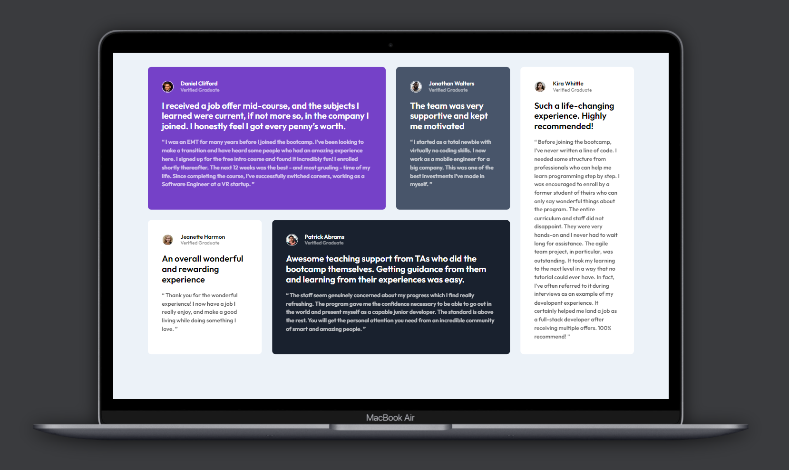
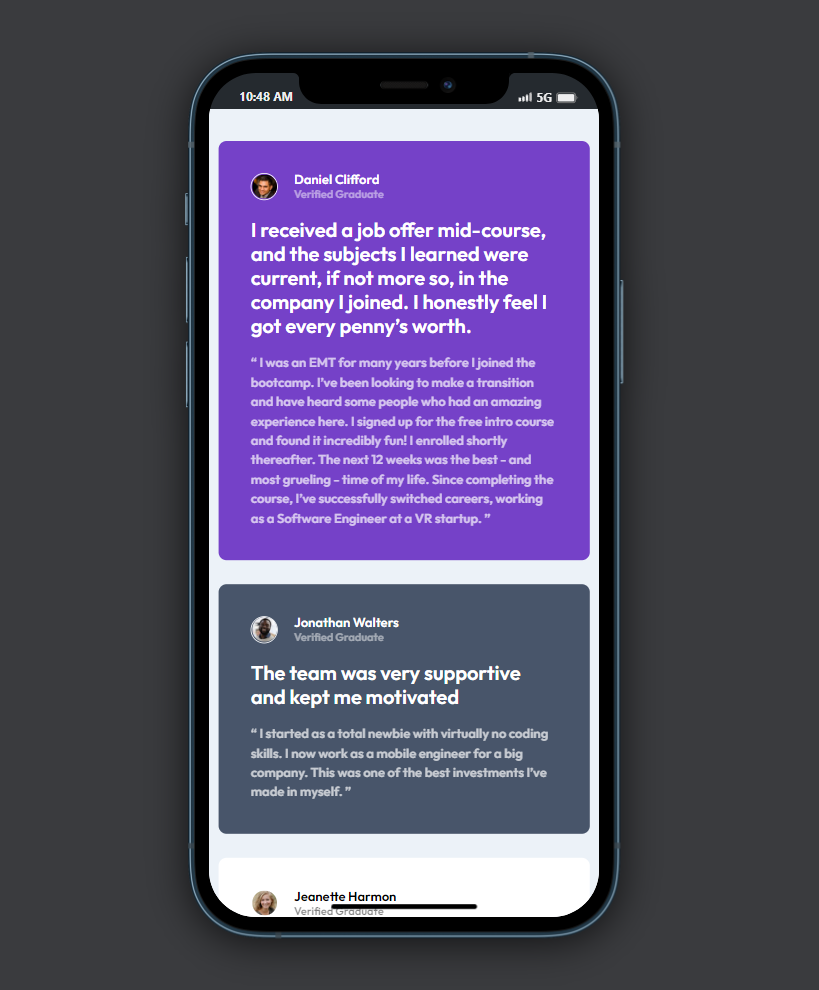

# Frontend Mentor - Testimonials grid section solution

This is a solution to the [Testimonials grid section challenge on Frontend Mentor](https://www.frontendmentor.io/challenges/testimonials-grid-section-Nnw6J7Un7).

## Table of contents

- [Overview](#overview)
  - [Screenshot](#screenshot)
  - [Links](#links)
- [My process](#my-process)
  - [Built with](#built-with)
  - [What I learned](#what-i-learned)
  - [Useful resources](#useful-resources)
- [Author](#author)

## Overview

The challenge was to build testimonials grid section and get it looking as close to the design as possible. And users should be able to view the optimal layout for the site depending on their device's screen size

### Screenshot

#### Desktop Preview

#### Mobile Preview

### Links

- Solution URL: [Solution](https://your-solution-url.com)
- Live Site URL: [Live](https://your-live-site-url.com)

## My process

### Built with

- Semantic HTML5 markup
- CSS custom properties
- Flexbox
- CSS Grid
- Mobile-first workflow

### What I learned

Till now I have only seen some tutorials on CSS grid layout but I didn't tried by myself. So, by completing this challenge I got know some other methods to apply grid layout and I got to do some hands on.

### Useful resources

- [cssmatic.com](https://www.cssmatic.com/box-shadow) - This helped me creating the shadows of the cards.

## Author

- Frontend Mentor - [@Himanshupegu](https://www.frontendmentor.io/profile/Himanshupegu)
